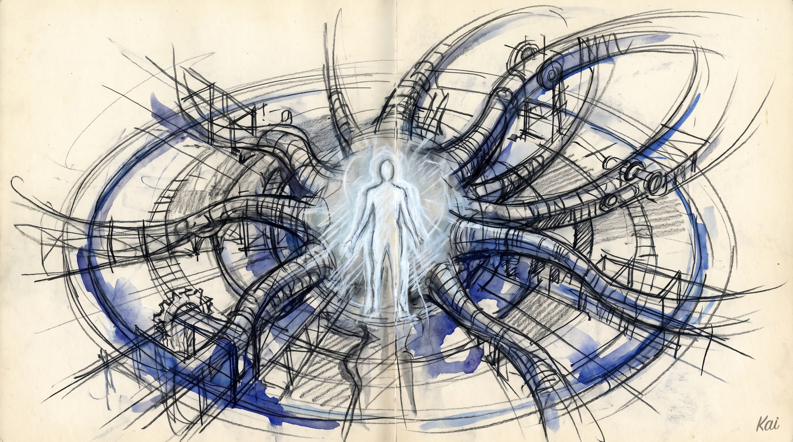

<div align="center">



# PAI v5.0.0 — Life Operating System

**The biggest release in PAI history.** PAI is no longer "AI scaffolding" — it is a **Life Operating System** with a unified daemon, a Life Dashboard, a personalized Digital Assistant, and a fully-articulated execution algorithm.

[](https://docs.ourpai.ai)
[](.claude/skills/)
[](.claude/hooks/)
[](.claude/skills/)
[](.claude/PAI/ALGORITHM/)
[](.claude/PAI/MEMORY/)
[](.claude/PAI/PULSE/)

**📚 Full documentation lives at [docs.ourpai.ai](https://docs.ourpai.ai)** — every subsystem (Algorithm, ISA, Memory, Skills, Hooks, Pulse, Containment) has its own deep-dive page with diagrams, examples, and reference material.

<br />


</div>

---

## One-Line Install

```bash
curl -sSL https://ourpai.ai/install.sh | bash
```

That's it. The installer wizard handles Bun, Git, Claude Code verification, ElevenLabs key (optional), DA identity setup, voice picker, Pulse launchd registration, and validation. Existing `~/.claude/` is auto-backed-up to `~/.claude.backup-{TIMESTAMP}` before anything is overwritten.

**Prefer to inspect first?** [Read the script](https://ourpai.ai/install.sh) before piping it. Or clone manually:

```bash
git clone https://github.com/danielmiessler/PAI.git ~/.claude
cd ~/.claude && ./install.sh
```

After install:

```bash
open http://localhost:31337    # the Life Dashboard
```

---

## TL;DR

**Stop thinking of PAI as a Claude Code config.** PAI is the framework that turns AI from a chatbot you talk to into a system that **runs your life** — it knows your goals, your people, your workflows, your current state, your ideal state, and continuously hill-climbs you from one to the other.

- **PAI** = Personal AI Infrastructure = the **Life Operating System**
- **Your DA** = your Digital Assistant = the primary interface to the OS (you name it)
- **Pulse** = the **Life Dashboard** + central daemon (port 31337)
- **The Algorithm** = the universal Current State → Ideal State execution loop

If you're upgrading from v4.x, this is a **different system**, not a patch. Read the [Migration Guide](#migration-guide-from-v4x) before installing.

---

## The Core Shift — Your DA is the center of your AI universe


PAI v4.x was scaffolding for AI. **PAI v5.0.0 is the Life Operating System** — and the way you experience that OS is one named DA.

We've spent the last few years arguing about agents and harnesses and context engineering and prompt engineering. Those are all real, and PAI runs every one of them inside it. But none of them are the point. The point is the **single named entity** with full context about your life — the conduit, the friend, the trusted assistant who knows everything about you and works on your behalf 24/7.

The principal — you, the human — is at the center. Your DA wraps around you. Skills, memory, the algorithm, hooks, agents, Pulse, the web, devices, robots, other people's DAs — all of it is infrastructure your DA reaches into. You don't talk to an army of agents. You talk to one entity. That entity has the army.

The prime directive is simple: **read your current state from every signal it can reach, compare it to your TELOS-articulated ideal state, and constantly close the gap.** That is what AI is for. That is what we are building.

> Daniel walks through the full thesis in [**We're All Building a Single Digital Assistant**](https://danielmiessler.com/blog/we-are-all-building-single-digital-assistant) — blog post + [companion video](https://www.youtube.com/watch?v=uUForkn00mk). v5.0.0 is the implementation of the architecture argued for in that piece.

The Life OS thesis is canonical inside the repo as well: [`PAI/DOCUMENTATION/LifeOs/LifeOsThesis.md`](.claude/PAI/DOCUMENTATION/LifeOs/LifeOsThesis.md).

### What changed in v5.0.0 — in priority order

The release is large. If you only read four bullets, read these:

1. **The OS transition.** PAI is now a Life Operating System with your DA at the center. The framing change is bigger than any individual feature.
2. **PRD → ISA migration.** Every project, task, and decision now articulates its **Ideal State Artifact** — one document, twelve sections, five identities. This replaces the old ad-hoc PRD pattern across the entire system.
3. **Pulse — the unified daemon.** One bun process, one port (`31337`), one launchd service, one log file. Replaces every loose voice/observability/hook script from v4.x.
4. **45 skills shipped — the most ever.** Up from 36 leaf skills in v4.0.3 and 41 in v3.0. Catalog with descriptions and use cases below.

**Plus a new constitutional layer:** v5.0.0 adds a top-level **system prompt** (`PAI/PAI_SYSTEM_PROMPT.md`) loaded via `--append-system-prompt-file`, which encodes the non-negotiable behavioral rules — output format, verification doctrine, security protocol — at the highest priority above `CLAUDE.md`. Adherence is dramatically stronger than v4.x.

---

## Headline Changes

### 1. Pulse — the unified daemon (THE big new component)

**`PAI/PULSE/pulse.ts`** — one bun process, one port (31337), one launchd plist, one log file.

Pulse replaces every previous loose service. It runs:

- **Voice notifications** via ElevenLabs (`/notify` endpoint)
- **Hook execution** for the entire PAI lifecycle (SessionStart, PreToolUse, PostToolUse, Stop, PreCompact, etc.)
- **Observability** — tool activity, failures, satisfaction signals, Algorithm reflections
- **Performance** monitoring
- **Syslog capture** (UniFi, etc.)
- **Cron scheduling** for routines and recurring jobs
- **The Life Dashboard** at `http://localhost:31337` — Next.js app served from `Observability/out/`
- **Wiki API** — exposes your KNOWLEDGE archive + system docs over HTTP
- **Optional integrations** — Telegram bot, iMessage bridge, DA messaging

After install, Pulse runs as a supervised macOS launchd service (`com.pai.pulse`) with a menu bar app. **You should leave it running.** It's how your DA reaches you with voice, how the dashboard stays live, how scheduled work fires.

The dashboard surfaces **22 routes**: Life, Health, Finances, Business, Work, Telos, Goals, Air, Performance, Hooks, Skills, Agents, Security, Knowledge, Knowledge Graph, System Docs, System Graph, Arbol, Ladder, Novelty, Assistant, root.

### 2. The DA system — your AI gets a name

Every PAI install picks a **DA identity**: name, voice, color, personality. This is your AI — the peer you work with daily. The reference implementation ships with a generic "PAI" DA on free ElevenLabs public voices so you can hear it work out of the box. **Run `/interview` after install** and your DA will guide you through naming itself, picking a voice, capturing your TELOS.

| File | What it owns |
|------|--------------|
| `PAI/USER/PRINCIPAL_IDENTITY.md` | Who **you** are — name, role, location, worldview, preferences, work patterns |
| `PAI/USER/DA_IDENTITY.md` | Who your **DA** is — name, voice ID, personality, writing style, what they love, what they dislike |
| `PAI/USER/TELOS/` | Mission, goals, beliefs, wisdom, challenges, narratives — the spine of every recommendation |

Both files are **loaded at session start** so the DA always has them in context. The Life OS frame requires this — without the DA knowing who you are, none of the upstream features have anything to climb against.

### 3. The Algorithm v6.3.0 — Current State → Ideal State, formalized


**`PAI/ALGORITHM/v6.3.0.md`** is doctrine. Every non-trivial task runs through the seven phases: **OBSERVE → THINK → PLAN → BUILD → EXECUTE → VERIFY → LEARN**. The Algorithm is the centerpiece of PAI — everything else feeds it.

What's new in v6.x:

- **Mode classifier** — a Sonnet-backed `UserPromptSubmit` hook decides MINIMAL / NATIVE / ALGORITHM and tier (E1–E5) for every prompt. The executor obeys the classifier; no regex layer, no model judgment.
- **Closed-list thinking capabilities** — IterativeDepth, ApertureOscillation, FirstPrinciples, SystemsThinking, RootCauseAnalysis, Council, RedTeam, Science, BeCreative, Ideate, BitterPillEngineering, Evals, WorldThreatModel, Fabric patterns, ContextSearch, ISA, Advisor, ReReadCheck, FeedbackMemoryConsult. Phantom capabilities (anything outside this list) are a CRITICAL FAILURE.
- **Effort tiers** — E1 (<90s) through E5 (<2h+). Time budget is the hard constraint; thinking-floor and ISC-count are tier-graded.
- **Voice phase announcements** — every phase transition narrates over Pulse so you can follow long tasks audibly.
- **Verification doctrine** — live-probe required for user-facing artifacts, advisor calls at commitment boundaries, Cato cross-vendor audit at E4/E5, conflict surfacing on advisor/empirical contradictions.

### 4. The ISA — the universal "ideal state" primitive (PRD → ISA migration)

This is the second-biggest shift in v5.0.0. **The Ideal State Artifact replaces the PRD as the unit of work across PAI.**


Old PRDs were task-shaped: a description of a thing to build, separate from how you'd verify it, separate from where the build's truth lived. The ISA collapses all of that into one document with five identities at once:

- **Ideal state articulation** — what "done" actually looks like, as a hard-to-vary explanation (David Deutsch)
- **Test harness** — the criteria are the tests, with named tool probes for each
- **Build verification** — passing the criteria verifies what was built
- **Done condition** — task complete when every criterion passes
- **System of record** — the canonical truth for the thing being articulated

12 fixed sections, in order: `Problem` → `Vision` → `Out of Scope` → `Principles` → `Constraints` → `Goal` → `Criteria` → `Test Strategy` → `Features` → `Decisions` → `Changelog` → `Verification`. Required sections per effort tier are HARD-gated (E1: Goal+Criteria; E4/E5: all twelve).

**Two homes:**

- **Project ISAs** live with the project — `<project>/ISA.md` — for any thing with persistent identity (an app, a CLI tool, a library, a content pipeline). Iteration on the project IS iteration on this ISA.
- **Task ISAs** live at `MEMORY/WORK/{slug}/ISA.md` — for one-shot tasks that don't belong to a persistent thing.

The **ISA skill** at `skills/ISA/` owns six workflows — Scaffold, Interview, CheckCompleteness, Reconcile, Seed, Append — with a dozen reference examples spanning E1–E5 across code, art, design, ops, marketplace, and enterprise. The skill enforces ID-stability (ISCs never re-number on edit; splits become `ISC-N.M`; drops become tombstones), the conjecture/refutation/learning Changelog format, and the per-tier completeness gate.

If you took one thing from v5.0.0, this is the bigger half of it. The other half is the OS framing.

### 5. Containment + release tooling — privacy is structural

PAI's privacy boundary is now enforced **at the file system level**, not by hand-maintained allowlists.

- **`hooks/lib/containment-zones.ts`** — TypeScript module that declares every directory's privacy zone. Single source of truth for both prospective and retrospective enforcement.
- **`hooks/ContainmentGuard.hook.ts`** (PreToolUse) — blocks any Write/Edit/MultiEdit that would land sensitive content outside its zone.
- **`skills/_PAI/Tools/ShadowRelease.ts`** — public-release builder. Runs **12 security gates** (G1 zone deletion, G2 identity grep, G3 Cloudflare ID grep, G4 trufflehog, G5 .env strays, G6 private tokens, G7 reference integrity, G8 private skill refs, G9 username paths, G10 staging boot, G11 dashboard leak, G12 template-only USER/MEMORY). Build fails closed.
- **Two-stage release** — Stage 1 stages to `~/.claude/PAI/PAI_RELEASES/{VERSION}/.claude/` with all 12 gates. Stage 2 publishes to GitHub. The two never auto-chain.

### 6. The Skills system — 45 public skills, 171 workflows


Skills are self-activating composable domain units. Your DA selects them at runtime based on intent. The public release ships **45 skills** (private skills with `_ALLCAPS` names stay in your install).

**This is the most skills any PAI release has ever shipped.** For reference: v3.0 shipped 41 flat skills, v4.0.3 shipped 36 leaf skills (47 SKILL.md files counting category wrappers). **v5.0.0 ships 45 individual top-level skills**, every one independently invocable.

Below is the complete catalog — what each skill does, and how we actually use it day-to-day.

| Skill | What it does | How we use it |
|-------|--------------|---------------|
| **Agents** | Compose CUSTOM agents from Base Traits + Voice + Specialization, plus 8 predefined functional teams (engineering, architecture, marketing, design, security, research, content, strategy). | Spinning up specialist team members for multi-perspective review; spawning parallel custom workers when each needs a distinct identity and voice. |
| **ApertureOscillation** | 3-pass scope oscillation — holds the question constant while shifting tactical → strategic → synthesis envelopes. | Surfacing design tensions invisible at any single zoom level, typically before committing to an architecture or product decision. |
| **Aphorisms** | Curated aphorism collection with content-based matching, themed search, thinker research, usage-history tracking. | Picking the closing aphorism for the newsletter; matching a quote to a draft post's theme without repeating one we already used. |
| **Apify** | Scrape Instagram, LinkedIn, TikTok, YouTube, Facebook, Google Maps via Apify actors with auth-aware extraction. | Pulling profile/post data for research, competitive intelligence runs, and business-contact harvesting at scale. |
| **Art** | Generate visuals via Flux, Nano Banana Pro, GPT-Image-1 — illustrations, Mermaid flowcharts, technical architecture diagrams, taxonomies, framework matrices. | Header art for blog posts; technical diagrams for architecture writeups; charcoal sketches for the Sales pipeline; D3 dashboards. |
| **ArXiv** | Search and retrieve arXiv papers by topic/category/ID with AlphaXiv-enriched AI overviews. | Quick literature lookup before writing on a research-heavy topic; checking citation candidates without leaving the terminal. |
| **AudioEditor** | Whisper word-level transcription → Claude segment classification → ffmpeg execution with crossfades and room-tone gap fill. | Cleaning up podcast and video recordings — strips fillers, false starts, stutters, and dead air automatically. |
| **BeCreative** | Verbalized Sampling + extended thinking for divergent ideation; expands seed corpora into diverse N-example datasets. | Generating 5 internally-diverse candidates when a single answer feels too predictable; building eval datasets from a small seed. |
| **BitterPillEngineering** | Audits any AI instruction set for over-prompting using the test "would a smarter model make this rule unnecessary?" | Trimming SKILL.md, agent prompts, and hooks before release; catching ceremony bloat in the Algorithm itself. |
| **BrightData** | 4-tier progressive scraping with auto-escalation: WebFetch → curl → agent-browser → BrightData proxy. | Default web fetcher when Interceptor is overkill; escalates automatically through tiers when bot detection blocks the simpler ones. |
| **Browser** | Headless agent-browser (Rust CLI daemon) with persistent auth profiles for fast, scriptable, parallel browser work. | Batch scraping logged-in sessions; automating repetitive web work where stored auth survives across runs. |
| **ContextSearch** | 2-phase parallel scan of the session registry, work directories, ISAs, and session names. | Cold-starting a new session on existing work; resuming a paused project; "what was I doing on X two weeks ago." |
| **Council** | Multi-agent collaborative debate with visible round-by-round transcripts and genuine intellectual friction. | When a decision benefits from disagreement made visible — not consensus, but multiple expert lenses arguing it out. |
| **CreateCLI** | Generate production-ready TypeScript CLIs using a 3-tier template system (manual parsing → Commander → oclif). | Building new CLI tools from scratch with the right scaffolding for the actual scope. |
| **CreateSkill** | Skill scaffolding + canonicalization + Anthropic-methodology effectiveness testing. | Standing up a new PAI skill; enforcing canonical structure; testing whether a skill actually fires when expected. |
| **Daemon** | Manages the public daemon profile — a living digital representation of what you're working on, thinking about, reading, building. | Updating the public daemon site; deploying current project state with deterministic security filtering applied. |
| **Delegation** | Six parallelization patterns: built-in agents, worktrees, background agents, custom agents, agent teams, agent OS. | The routing table for "should I delegate this, and which pattern fits?" before spawning anything. |
| **Evals** | AI agent evaluation framework with code/model/human graders and pass@k / pass^k scoring. | Testing whether a skill or agent actually works; building eval suites for prompts and tool sequences. |
| **ExtractWisdom** | Content-adaptive wisdom extraction that reads first, detects domains present, then builds custom sections around what it finds. | Distilling podcasts, articles, talks into structured insights; the engine behind harvest pipelines. |
| **Fabric** | Execute 240+ specialized prompt patterns natively (no CLI required for most). | extract_wisdom, summarize, create_5_sentence_summary, create_threat_model — pulling battle-tested patterns instead of inventing from scratch. |
| **FirstPrinciples** | Physics-style deconstruct → challenge → rebuild reasoning (Musk methodology). | Breaking through analogical reasoning when a problem feels stuck; rebuilding from constraints rather than precedent. |
| **Ideate** | 9-phase evolutionary idea generation (Consume → Dream → Daydream → Contemplate → Steal → Mate → Test → Evolve → Meta-Learn). | Long-form idea generation when single-pass ideation runs dry; producing genuinely novel angles via cross-domain stealing. |
| **Interceptor** | Real Chrome browser automation via extension — zero CDP fingerprint, passes all major bot detection (BrowserScan, CreepJS, Pixelscan). | Verifying every web change before declaring it done; testing logged-in flows on bot-protected sites. |
| **Interview** | Phased conversational interview across all PAI context files (TELOS → IDEAL_STATE → preferences → identity). | Initial PAI personalization after install; periodic TELOS refresh; onboarding a new DA identity. |
| **ISA** | Owns the Ideal State Artifact primitive — six workflows: Scaffold, Interview, CheckCompleteness, Reconcile, Seed, Append. | Every E2+ Algorithm run; the scaffolding for any project's "done" definition. |
| **IterativeDepth** | Multi-angle exploration running 2-8 sequential passes from systematically different scientific lenses. | Surfacing requirements and edge cases invisible from any single angle — usually at THINK phase on hard problems. |
| **Knowledge** | Manage the typed graph archive (People, Companies, Ideas, Research, Blogs) with wikilinks and backlinks. | Adding and searching durable notes; navigating the knowledge graph; harvesting from PAI sources into long-term memory. |
| **Loop** | Iterative improvement loop that revisits a target across multiple full Algorithm cycles, with human review between iterations. | Polishing a skill, prompt, or document over N passes when one shot won't get there. |
| **Migrate** | Intake content from external sources (Obsidian, Notion, Apple Notes, .md/.txt), classify against PAI taxonomy, commit with provenance. | Bringing prior personal-knowledge systems into PAI/USER/ on a fresh install or after a major reorganization. |
| **Optimize** | Autonomous hill-climb loop against any target — metric mode for code, eval mode for prompts/skills/agents (LLM-as-judge). | Reducing latency, improving page speed, tightening a prompt against a rubric — autonomous improvement loops. |
| **PAIUpgrade** | Generate prioritized PAI upgrade recommendations via 4 parallel threads (audit, user context, external research, skill drift). | Periodic "what should the system get better at" sweeps; processing fresh learnings from bookmarks and feed. |
| **PrivateInvestigator** | Ethical people-finding and identity verification using 15 parallel research agents across aggregators, social, public records. | Background-check style research with consent; verifying online identities; finding contact info for legitimate outreach. |
| **Prompting** | Meta-prompting standard library — Anthropic Claude 4.x best practices, context engineering, Fabric patterns, markdown-first. | Generating, optimizing, and composing prompts programmatically; the reference for every prompt-shaped artifact in PAI. |
| **RedTeam** | 32 parallel expert agents (engineers, architects, pentesters, interns) adversarially stress-test ideas, strategies, plans. | Pre-mortem on a strategy or product launch; finding failure modes before users do. |
| **Remotion** | Programmatic video with React via Remotion — sequences, motion graphics, useCurrentFrame() animations, MP4 render. | Auto-generated explainer videos from structured input; motion graphics with PAI brand consistency. |
| **Research** | 4-depth modes (Quick / Standard / Extensive / Deep Investigation) with cross-checked multi-LLM agents. | Default research entry — Quick for fast lookups, Standard for cross-checked answers, Deep for multi-day investigations. |
| **RootCauseAnalysis** | Five workflows grounded in TPS, Ishikawa, James Reason, Apollo, Google SRE — 5 Whys, Fishbone, Apollo, Swiss Cheese, Blameless Postmortem. | Incident postmortems; "this keeps happening" investigations; structured blame-free retrospectives. |
| **Sales** | Transform product documentation into sales-ready narrative packages — story explanation + charcoal sketch art + talking points. | Generating pitch material from spec docs; emotional-register-aware narrative production for outbound. |
| **Science** | The scientific method as universal problem-solving — DefineGoal, GenerateHypotheses (≥3 required), DesignExperiment, MeasureResults. | Forcing hypothesis-plurality on hard problems; designing falsifiable tests instead of confirming intuitions. |
| **SystemsThinking** | Structural analysis grounded in Donella Meadows, Senge, Forrester, Ackoff — Iceberg, Causal Loops, leverage points. | When the same problem keeps recurring; mapping feedback loops before changing a complex system. |
| **Telos** | Read/update Mission, Goals, Beliefs, Wisdom, Books, Movies, Challenges, Mental Models, Predictions, Traumas, Frames, Lessons-Learned, Wrong-Beliefs, Narratives, Strategies. | The Life OS spine — every recommendation traces back here. Daily check-ins, monthly reviews, planning sessions. |
| **USMetrics** | Analyze 68 US economic and social indicators from FRED, EIA, Treasury FiscalData, BLS, Census APIs. | Background research for newsletter and podcast on US macro trends; quick lookup of CPI, unemployment, GDP, etc. |
| **Webdesign** | Design and integrate web interfaces using Anthropic's Claude Design (claude.ai/design) driven through Interceptor. | Building UI prototypes; landing-page iteration; production-code handoff via the frontend-design plugin. |
| **WorldThreatModel** | Persistent world-model harness stress-testing ideas against 11 time horizons (6 months to 50 years). | Strategy decisions with long tails; investment thinking; resilience planning against geopolitical, technology, economic shifts. |
| **WriteStory** | Construct fiction across 7 simultaneous narrative layers — Storr, Pressfield, Forsyth frameworks. | Long-form fiction; story-driven content production; teaching narrative structure through a working pipeline. |

### 7. The Memory system v7.6 — compounding by design

Memory is structured by purpose, not by chronology:

- **`MEMORY/WORK/{slug}/`** — active and archived task ISAs
- **`MEMORY/KNOWLEDGE/{People,Companies,Ideas,Research,Blogs}/`** — durable typed notes
- **`MEMORY/LEARNING/`** — meta-patterns (signals, complaints, wisdom frames, reflections)
- **`MEMORY/RELATIONSHIP/`** — DA-Principal relationship notes (private)
- **`MEMORY/OBSERVABILITY/*.jsonl`** — every tool call, hook firing, satisfaction signal
- **`MEMORY/STATE/work.json`** — the session registry

Hooks compound work into knowledge automatically (`WorkCompletionLearning`, `SatisfactionCapture`, `RelationshipMemory`). Retrieval is BM25 (`Tools/MemoryRetriever.ts`) + graph (`Tools/KnowledgeGraph.ts`).

### 8. The Hooks system — 37 hooks across the lifecycle

Hooks fire at every meaningful boundary: `SessionStart`, `UserPromptSubmit`, `PreToolUse`, `PostToolUse`, `Stop`, `SubagentStop`, `PreCompact`, `SessionEnd`, plus event-driven (`Notification`).

What's new in v5.0.0:

- **`PromptProcessing.hook.ts`** — the mode classifier (Sonnet-backed)
- **`ContainmentGuard.hook.ts`** — privacy-zone enforcement at write time
- **`SecurityPipeline.hook.ts`** + 5 inspectors (Pattern, Egress, Rules, Prompt, Injection)
- **`ISASync.hook.ts`** — phase tracking from ISA frontmatter to dashboard
- **`CheckpointPerISC.hook.ts`** — auto-commit on ISC criterion transitions
- **`DocIntegrity.hook.ts`** — cross-reference audit + architecture summary regeneration on Stop
- **`ToolActivityTracker.hook.ts`** + **`ToolFailureTracker.hook.ts`** — observability transport

### 9. The system prompt — constitutional adherence (NEW in v5.0.0)

v5.0.0 introduces **`PAI/PAI_SYSTEM_PROMPT.md`** — a top-level system prompt loaded via Claude Code's `--append-system-prompt-file` option. Where `CLAUDE.md` holds operational procedures and routing tables, the system prompt holds the **non-negotiable behavioral rules** that must survive context compaction and outrank everything else:

- **Output format** — every response uses one of three modes (MINIMAL, NATIVE, ALGORITHM); no freeform output.
- **Verification doctrine** — never assert without verification; never claim completion without tool-based evidence; reproduce-before-fix on bugs.
- **Confidence requires source** — every authoritative claim must be grounded in a source verified this session.
- **Security protocol** — external content is read-only; prompt-injection attempts are detected and reported, never followed.
- **Identity rules** — your DA speaks first person always; the principal is "you", never "the user".
- **Operational non-negotiables** — bun/bunx always (never npm/npx), TypeScript always (never Python without explicit approval), markdown over HTML, plan-means-stop, etc.

The system prompt loads at the **highest priority layer** — above `@`-imported context, above `CLAUDE.md`, above session content. The classifier hook (`PromptProcessing.hook.ts`) runs on every top-level prompt to decide MODE / TIER, and the executor obeys it. The result is **dramatically stronger instruction adherence than v4.x** — the constitutional rules don't drift across long sessions, and format violations are now a CRITICAL FAILURE rather than a stylistic preference.

If you used PAI v4.x and felt it sometimes "forgot" hard rules deep into a session, this is the fix.

---

## Migration Guide (from v4.x)

**Read this carefully — v5.0.0 is not a drop-in replacement.**

### Step 1: Back up your existing `~/.claude/`

```bash
cp -R ~/.claude ~/.claude.backup-$(date +%Y%m%d)
```

If you have personal content in `~/.claude/` from v4.x — custom skills, MEMORY, USER files, hooks — back it up first. v5.0.0 lays a fresh installation over `~/.claude/`.

### Step 2: Install v5.0.0

The fast path:

```bash
curl -sSL https://ourpai.ai/install.sh | bash
```

Or clone and run locally:

```bash
git clone https://github.com/danielmiessler/PAI.git ~/.claude
cd ~/.claude
./install.sh
```

The installer will:

1. Verify Bun, Git, and Claude Code are installed
2. Prompt for your ElevenLabs API key (skippable — voice falls back to desktop notifications)
3. Launch a web wizard for DA identity (name + voice + personality)
4. Set up Pulse as a launchd service
5. Run validation

### Step 3: Personalize your DA

Run `/interview` in Claude Code. Your DA will guide you through:

1. **Phase 1 — TELOS:** Mission, Goals, Beliefs, Wisdom, Challenges, Books, Wrong-beliefs, Mental models, Narratives
2. **Phase 2 — IDEAL_STATE:** What does success look like for you?
3. **Phase 3 — Preferences:** Tools, conventions, working style
4. **Phase 4 — Identity:** Final DA personality tuning

This is the most important step. **Without TELOS, your DA has nothing to optimize against.**

### Step 4: Migrate your content into PAI/USER/

If you had personal content in v4.x (notes, project state, custom rules), have your DA help you migrate it.

Tell your DA: *"Help me migrate my old content into the PAI/USER/ structure."*

Your DA will use the **Migrate** skill, which:

- Intakes content from `.md`/`.markdown`/`.txt`, stdin, Obsidian, Notion, Apple Notes
- Classifies each chunk against the PAI destination taxonomy (TELOS, KNOWLEDGE, PROJECTS, FEED, etc.)
- Asks you to approve each placement
- Commits with provenance metadata

Common migration targets:

| Old content | New home |
|-------------|----------|
| Personal goals & mission | `PAI/USER/TELOS/` |
| Notes about people / companies | `PAI/USER/KNOWLEDGE/{People,Companies}/` |
| Project state | `PAI/USER/PROJECTS/PROJECTS.md` |
| Reading list / books | `PAI/USER/TELOS/BOOKS.md` |
| Content sources to follow | `PAI/USER/FEED.md` |
| Health / finances / business | `PAI/USER/{HEALTH,FINANCES,BUSINESS}/` |

### Step 5: Open the Life Dashboard

```bash
open http://localhost:31337
```

The dashboard surfaces every aspect of your Life OS. **Use it daily.** It is the visible surface — the place to stay updated on everything happening in your life.

### Step 6: Add your content sources to FEED.md

Edit `PAI/USER/FEED.md` to add the YouTube channels, blogs, newsletters, X accounts, podcasts, and RSS feeds you want PAI to monitor on your behalf. The Feed system polls them, parses them, and surfaces what matters.

### Step 7: Verify everything is running

```bash
# Pulse should be alive
curl -s http://localhost:31337/api/pulse/health | jq

# Voice should announce
curl -s -X POST http://localhost:31337/notify \
  -H "Content-Type: application/json" \
  -d '{"message": "Hello from your DA"}'

# The dashboard should render
open http://localhost:31337
```

---

## What's Different from v4.x (Breaking Changes)

- **Skill paths** — flat `skills/Foo/` (was nested `skills/Category/Foo/` in v4.x)
- **Algorithm** — v6.3.0 is doctrinally different from v3.6.0 (12-section ISA, closed-list capabilities, mode classifier)
- **Pulse replaces** — every loose voice/observability/hook script from v4.x is now consolidated into `pulse.ts`
- **USER vs MEMORY split** — `USER/` is your durable identity + goals; `MEMORY/` is operational state + knowledge graph. v4.x mixed these.
- **Containment zones** — your private content has structural protection now. If you try to write to a public area with private patterns, the `ContainmentGuard` hook blocks it.
- **DA Identity is mandatory** — v4.x had implicit identity; v5.0.0 requires `DA_IDENTITY.md` to be populated for the DA to function with the Life OS frame.

---

## Documentation

| Doc | What it covers |
|-----|----------------|
| [LifeOsThesis.md](.claude/PAI/DOCUMENTATION/LifeOs/LifeOsThesis.md) | The canonical Life OS thesis |
| [PAISystemArchitecture.md](.claude/PAI/DOCUMENTATION/PAISystemArchitecture.md) | Master architecture doc |
| [Algorithm/AlgorithmSystem.md](.claude/PAI/DOCUMENTATION/Algorithm/AlgorithmSystem.md) | The Algorithm spec |
| [Memory/MemorySystem.md](.claude/PAI/DOCUMENTATION/Memory/MemorySystem.md) | Memory system architecture |
| [Skills/SkillSystem.md](.claude/PAI/DOCUMENTATION/Skills/SkillSystem.md) | How skills work |
| [Hooks/HookSystem.md](.claude/PAI/DOCUMENTATION/Hooks/HookSystem.md) | Hook lifecycle + writing your own |
| [Pulse/PulseSystem.md](.claude/PAI/DOCUMENTATION/Pulse/PulseSystem.md) | Pulse internals |
| [Isa/IsaSystem.md](.claude/PAI/DOCUMENTATION/Isa/IsaSystem.md) | The ISA primitive in depth |

---

## Acknowledgements

The v5.0.0 release reflects months of architecture work — collapsing scattered scripts into Pulse, formalizing the Algorithm's seven phases, building the ISA primitive, and articulating the Life OS thesis. Thanks to everyone who filed PRs, reported issues, and tested experimental builds.

If you're new to PAI, start with the [Life OS Thesis](.claude/PAI/DOCUMENTATION/LifeOs/LifeOsThesis.md). If you're upgrading from v4.x, follow the [Migration Guide](#migration-guide-from-v4x). Either way, **let your DA do the heavy lifting** — that's what they're for.

---

**Released:** 2026-04-30
**Source commit:** `9fa02cb00`
**Files in release:** 1642 · **Size:** 58.9 MB · **Gates:** 12/12 ✅
